# AGRAV

Anti-gravity combat racing for up to twelve players, in the browser.

## Race

**Race solo vs bots** needs no server: the lobby and room engine runs inside the page, so the
game works from a static deploy (GitHub Pages) or offline once installed — a full grid of
seven bots, every track, every craft. Online, create a race (you become the host) or join one
by code or from the public list. The host
picks the track, the lap count and how hard the bots drive -- easy, medium or hard -- can add
bots and starts once everyone is ready. Three laps by default. Bots run on the server, so their
level belongs to the room rather than to your client; it is remembered, so a solo race starts
where you left off. Medium is the bot this game always had. Easy holds a lower pace -- the share
of the craft it will use -- because that, rather than driving skill, is what sets a bot's lap
time: a bot is at full throttle except when a corner makes it brake. Medium is already using all
of the craft, so what hard adds is **a better craft than the one in your hands** -- five percent
more top speed, close to twenty percent more acceleration out of a corner, and ten percent more
turn rate and grip, so it carries more through a bend and straightens earlier. That is deliberate,
and the only thing hard adds beyond a tidier line; it is never tougher and its guns never hit
harder. The same grid laps Neon Meridian in about 43 s on easy, 38 s on medium and 36 s on hard,
and hard is a couple of seconds a lap clear of medium on every track.
**Zero health eliminates you**: the craft explodes and you spectate
(tap or click to follow another racer) until the race ends. A race ends when every
surviving craft has finished, or 45 seconds after the first one did. Finished craft keep
driving a cool-down lap. Results rank finishers by time, then everyone else by distance.
The room offers fullscreen while you wait for the start, both as the browser's own shortcut
(F11, or ⌃⌘F on a Mac, which a page cannot press for you) and as a button, which can. On a phone
the tap that starts a race takes the whole screen by itself, since the browser's chrome is a large
slice of a small one. Safari has no Fullscreen API outside video, so there it does nothing and
installing to the home screen is the way there -- the manifest already asks for a fullscreen
display mode. It asks for landscape too, and a race locks the orientation where the browser allows
it -- only inside fullscreen, and not in Safari at all -- so a phone held upright while driving gets
asked to turn instead. The standings hide on a touch device, since the thumb buttons sit where they
would be; the results screen still has the order.
Choosing a track prepares it there and then, behind a progress bar: terrain and texture sets, the
scene itself, and every shader it will need. That last part is the long one and it is sliced across
frames, so the lobby keeps painting -- and the backdrop becomes the track you are about to race.
Above the craft cards the one you have picked turns on a pad in its team colour, engines ticking
over; drag sideways to turn it by hand. It draws in a canvas of its own with its own renderer,
because the lobby panels blur whatever of the main canvas shows through them. A second context is
not free, so it is built for what a phone can spare (`src/render/preview.js`): it draws with its own
half-size copies of each hull's five 1024² maps, and it gives the whole context back on leaving the
lobby, so nothing of it is held through a race. The hulls' geometry and some materials are still
shared with the race, and three hangs a dispose listener on each one a renderer touches -- enough to
keep every released renderer alive -- so the preview notes the listeners its renderer adds and takes
them off again when it lets go.

| Keyboard | Gamepad | Touch |
|---|---|---|
| ← → or A D steer | left stick / d-pad | tilt the phone (or drag, in settings) |
| ↑ / W throttle · ↓ / S brake | A or RT throttle · LT brake | automatic throttle · BRK button |
| Q / E airbrakes | LB / RB | AIR L / AIR R |
| space fire | X or B | FIRE |

A phone steers by tilt. Neutral is wherever you are holding it when the race opens rather than the
phone lying flat on its back, so the grid takes the angle you are already at and twenty-six degrees
off it is full lock, with a couple of degrees of slop around the middle so a held phone does not
wander. iOS hands over the motion sensor only when a page asks from inside a gesture, so the ask
rides on the taps that start a race; a phone with no sensor, or an owner who says no, falls back to
dragging in the steering zone with nothing to set. Every one of those failures is otherwise silent,
so a touch device that has settled on drag says why once the race is under way -- no sensor, a
refused prompt, or a page served over plain http, which iOS will not give the sensor to at all.

Settings are stored merged rather than as a diff -- `setSetting` writes the whole object -- so the
defaults of the day a player first typed their name are frozen into their phone, and changing a
default reaches nobody who has played before. `settings.version` and `migrate()` are how a changed
default is actually delivered; tilt steering is the first thing to need it.

Being destroyed makes you a spectator, and the rest of a race is a long time to watch when you are
not in it, so an eliminated racer gets a **Leave race** button under the status. A racer who has
merely finished does not: the result is still coming and leaving would throw it away.

Airbrakes tighten a turn and bleed speed; you need them for the hairpins. Hands off the
stick and the craft settles back along the track, but it never steers a bend for you.
A key is a switch, so keyboard steering winds on over about a tenth of a second rather than
snapping to full lock, and the hull rolls into the turn and pitches with the road behind it.
Walls scrape health away; hit one hard and you lose speed and armour. A crest that falls
away faster than gravity launches you.

The bottom left corner is the damage readout: a plan view of your own craft that takes on
scorch marks and turns from team colour through amber to red as the plating goes, beside a
ten-segment armour bar whose white ghost marks where the hull was a moment ago, so you can
see the size of the hit you just took. Below about a third the numbers go red and the screen
edge reddens and pulses. Every hit also washes the edge it came from and swings a red arc
onto that side of the silhouette.

## Craft

| | Speed | Accel | Turn | Damage | Armour |
|---|---|---|---|---|---|
| **Kestrel** | + | − | − | − | − |
| **Talon** | | ++ | | | − |
| **Vantage** | − | | ++ | | − |
| **Bulwark** | − | − | | | ++ |
| **Reaper** | | | − | ++ | |
| **Corsair** | the honest choice | | | | |

`tools/balance.js` keeps every craft's solo lap time within 3 % of the others on every track.

The hulls are lofted on the client (`src/render/vehicle.js`): superellipse sections swept along
each ship, wings and fins lofted the same way, panel seams pressed into the mesh along the lines
the livery paints. Each ship wears a painted 1024² atlas (`src/render/livery.js`) with albedo,
normal, bump, roughness and emissive maps: team paint and pattern, a race number, panel lines and
rivets, the team wordmark and four sponsor decals. Sponsors are invented: Umbrella Corporation,
Zenith Fuel, Neo-Kyo Dynamics, Axiom Avionics, Pulse, Vanta Optics, Orbital Logistics, Hypercell,
Synth Audio, Nova Coolant. Exhausts are shader plumes (`src/render/exhaust.js`): an open tube
behind each nozzle whose fragment shader burns a white-hot core into the team colour, breaks the
edge with scrolling noise, thins toward the tip and thickens where the eye looks through the
middle; throttle and boost ease its length and heat, and a Homeworld-style ribbon trail hangs in the air
behind each engine -- about a hundred and fifty metres of it at racing speed, two seconds' worth when
you are slow. The trail is laid from the nozzle and left in world space, tapering and closing to a
point rather than ending in a stub, so it begins at the engine with nothing between the two. It is
solid for its first half and fades away to nothing over its second, keyed on how far down the ribbon
a point sits rather than on its age: at speed the ribbon is bounded by the number of points it keeps
rather than by how long they live, and an age fade would cut the tail off mid-fade. The fire is drawn over its first few metres and is not rigid: the vertex shader bends it
along the path the trail has just recorded, so turning hard sweeps the flame round behind the craft
instead of leaving a cone bolted to its back, and the two read as one plume. The sweep is capped at
half the flame's own length so it can never fold back through itself, and with no path to follow --
standing still, or a frame rate too low to have laid one -- it simply straightens. Shields and weapons are shaders too
(`src/render/fxshaders.js`): hex-cell shield skins with a fresnel rim, a scanning band and a ripple
spreading from where a hit lands; rockets and missiles as white-cored bolts with streaks and fading
ribbon trails (missiles carry a plume); noise-eroded fireballs with a shock ring; minigun tracers as
stretched bolts. A **minigun burst** is a turret, not a bare tracer (`src/render/minigun.js`): a
hatch in the craft's accent opens on the spine, a six-barrel gun rises through it, trains on the car
the shot will actually hit — the same cone test the sim scores with, so it points at nothing when
the nose is not lined up — spins up, fires from its muzzle, and sinks back when the ammo runs out.
It is hidden while it is stowed, so a craft that is not shooting costs nothing to draw. A **mine**
leaves the rack with a flash and a ring opening on the road where it lands, and strobes hard for the
half second it takes to arm before settling to the slow red pulse of a live one: you drop it behind
you at two hundred klicks, and the drop itself has to be the feedback. The same sponsors advertise
along every track: a banner under each light gantry, roadside billboards on posts beyond the
barriers in the canyon and on the coast, and sponsor spots in rotation on the city's wall screens
and holo boards.

| Craft | Shape | Livery |
|---|---|---|
| **Kestrel** | slim centre body, forward-swept pontoons, joining wing, twin small nozzles | cyan, stripes, #7, Zenith title |
| **Talon** | blunt nose, wide delta deck, one broad engine, intakes beside the canopy | orange, chevrons, #21, Pulse title |
| **Vantage** | catamaran hulls, bridge deck, pylon nacelles, forward planes | lime, split colour, #3, Vanta Optics title |
| **Bulwark** | armoured slab, ram nose, four stubby nozzles, thick low fin | grey, checker band, #44, Umbrella Corporation title |
| **Reaper** | knife nose, forward-canted side fins, tall tail, nacelles under the wings | red, flames, #13, Umbrella Corporation title |
| **Corsair** | teardrop fuselage, swept wing, tall fin, root-mounted nacelles | violet, pinstripe, #1, Orbital title |

## Tracks

- **Neon Meridian** — night city: a canyon between towers, a climb onto an elevated ramp
  with a jump, a plunge into an underpass, a chicane under the ramp, a hairpin home.
- **Sunfall Canyon** — desert: a rim run, a drop off a shelf onto the river floor, a
  banked hairpin, a climb back through the strata.
- **Cape Vanta** — coastal cliffs: cliff-edge sweepers, a tunnel through the headland, a
  jump across the cove, a chicane on the beach, a long sweep round the south point.
- **Inferno Basin** — hellscape: a causeway over a lava lake, a climb up a volcano's flank to a
  lip and **two seconds of air** over a lava chasm — twelve metres above the road, ninety above the
  melt — esses through the cinder field, a wide banked loop round a caldera. Meteors fall the whole
  race; the road itself glows like cooling lava.
- **Mare Selene** — the Moon: a sweep along a crater rim, a long straight into a full
  **loop-the-loop**, a descent through the boulder field, a chicane past the moon base.
- **Osa Reef** — Costa Rican jungle coast: a causeway through the trees, a dive under the sea in
  a glass tunnel past a sunken city, a mangrove beach, then a second dive into a three-quarter
  spiral (three right-handers in a row) that climbs until the tunnel crosses over its own entry.

A missile announces itself to the craft it is chasing: **MISSILE LOCK** over the road, a bearing
held on the ring round the hull, and an alarm that beeps faster the closer it gets. The lock is a
flag on the snapshot rather than something the client works out, because the projectile on the wire
says where a missile is and not who it wants -- from the cockpit a missile flying past and one
coming for you look identical.

Getting hit costs speed as well as hull: a rocket scrubs 14 %, a missile 20 %, a mine 28 %, each
minigun round about 1 %. Craft-to-craft contact is mass-weighted (armour is mass): the heavier
hull gives way less, side swipes scrub sliding speed and twist both hulls, nose-to-tail shoves the
slower craft on, and every bump costs a little energy (`CONTACT` in `shared/agrav/constants.js`).

Contact is also something you see: sparks off the face where the two hulls meet, at the midpoint of
the pair. The sim reports a bump on every tick two hulls overlap -- a side swipe at racing speed
runs over eighty of them -- so `Fx.bump` throttles per pair, a small shower every 120 ms for as long
as the grind lasts and one hot white burst the moment a pair meets above `CONTACT.hardHit`, where
the ram does damage. Unthrottled a single scrape restarts all fourteen spark slots six times over
and leaves nothing for the explosions.

## Start procedure and soundtrack

When the host starts, every client builds the track scene and reports in; the grid holds
("GET READY") until everyone is in, or for eight seconds at most, then counts 3, 2, 1, 0 with a beep
per number and a GO. Six synthesized techno tracks (`src/music.js`) rotate race by race, sequenced
at sixteenth-note resolution from pattern data and played through Web Audio oscillators and
noise, each with an intro, a build, a lead section and a breakdown: Canyon Carver (150), Meridian
Overdrive (160), Vanta Tide (145), Anti-Grav League Anthem (172), Umbrella Protocol (140) and
Hypercell (165 bpm). N skips to the next track during a race. `node tools/musicpreview.js` renders
each one to a WAV so you can audition them without racing.

## Items

Pads on the track hand out one item; drive over one while holding nothing. Trailing racers
get better odds of missiles and shields, leaders of mines and the minigun. Bots go for them:
with an empty slot a bot picks the nearest row ahead that still has a live pad and eases onto
that lane over the whole approach, unless it is busy with a corner. It fires a rocket only
when its nose is already on where the target will be, spends a minigun burst only on a victim
inside the cone the hitscan actually scores with, and will burn a shield on an inbound rocket
or a mine ahead as well as on a missile already locked on.

| Item | |
|---|---|
| Rockets ×3 | fast and straight; hold fire for the burst |
| Missile | locks the nearest craft ahead and homes; the target is warned; a shield absorbs it |
| Minigun | two seconds of hitscan, lag-compensated |
| Mines ×3 | dropped behind you; arm after half a second; live 30 s |
| Repair | +40 health |
| Shield | 5 s of invulnerability |
| Turbo | 3 s at +35 % top speed |

## Environments

Everything you see beside the road is generated on the client from a seed the moment the
track is chosen (the lobby prewarms it), so the server ships nothing but the ribbon:

- **Material sets** (`../shared/gfx/surfaces.js`): a height function per surface is evaluated
  once per texel and yields the albedo, a Sobel normal map, a bump map, a roughness map and,
  for the city facades, an emissive map with lit windows. Asphalt with recessed panel seams and
  puddles, canyon strata with cracks and ledges, striated coastal rock, rippled sand, riveted
  plating, formwork concrete, water normals.
- **Terrain** (`src/render/terrain.js`): one displaced grid per track. Each vertex knows its
  nearest ribbon frame, the theme shapes the landscape from that (ridged canyon walls and a
  river channel, cliffs falling through a beach into the sea), and a corridor rule caps the
  ground just under the road so it never pokes through while bridges stay bridges. That rule holds
  through tunnels too: a height field cannot have a hole, so the cap is what cuts the bore, and the
  swept rock tube roofs the cutting over. Exempt the tunnel frames from it and the hillside closes
  across the road instead. The material
  blends two sets by slope and samples them triplanar so cliff faces do not smear.
- **Displaced geometry** (`src/render/props.js`): rocks, mesas, cliff slabs, sea stacks and
  arches are primitives pushed by 3D noise; towers come tiered, round or stepped with ledges and
  rooftop clutter; tunnels are cross-sections swept along the ribbon and roughened.
- **Neon Meridian's life** (`src/render/env/city.js`): wall screens run generated adverts of six
  kinds (wordmarks, product discs, glyph walls, the watching eye, tickers, racing promos) and swap
  and flicker; vertical kanji signs and small signage crowd the road-facing faces; a skytrain weaves
  on a lit guideway suspended above the expressway; ten stacked lanes of flying traffic (taxis
  first) climb the canyon between the towers; glass sky bridges cross high over the road;
  searchlights sweep from the tallest roofs. Everything moving stays above the road or beyond the
  barriers, so none of it touches the race.
- **Inferno Basin** (`src/render/env/hell.js`): a red desert basin with lava basins carved under
  the causeway and the jump, the melt glowing through crust cracks on an emissive map that
  scrolls; seven volcanoes with ember columns that erupt every few seconds (a fireball and a
  shower of lava bombs), each crater carrying a glow that reads from the road four hundred metres
  away; buttes, weathered slabs and spires filling the middle distance, obsidian shards nearer the
  road, fissures with the melt showing through the plain, lava falling into the chasm and over the
  lake wall, steam vents breathing beside the verge and pools of ember light along it; pylons under
  the causeway where it flies over the melt, and none over the chasm, where an eighty-metre column
  would turn the leap into a viaduct; a pool of meteors that streak in from a dome round the
  camera and burst on the plain (never on the road), plus distant streaks; rising cinders, falling
  ash, red mist; two flocks of black pterodactyls; charred trees that stir in the heat; the road
  material swapped for cooling lava.
- **Mare Selene** (`src/render/env/moon.js`): a cratered mare (voronoi bowls with raised rims)
  under a sky with the Milky Way, the Earth and a station crossing overhead. The light is the
  point: almost no fill, so shadows go near-black, while bright ejecta rays streak out of every
  crater and the floors sink to almost nothing — one dim overhead fill keeps the road readable.
  Angular rock near the road, a farther band breaking the skyline, and grit over the regolith;
  four glass-domed base clusters lit from inside with airlocks, tubes, blinking masts, sweeping
  dishes and arrays that tilt to follow the sun; an Apollo lander with a flag that ripples, a
  parked rover and one driving a circuit, throwing up dust that arcs and drops straight back in the
  vacuum; a crashed saucer a third buried, its lamps still blinking and sparking. The
  **loop-the-loop** carries its own beacon rail and lamps, because `placeAlong` will not hang
  scenery beside a loop and the hoop would otherwise be an unlit void. It is a
  one-turn helix: its control points carry `loop: 1`, which gives those frames a
  parallel-transported basis (see `shared/sim/spline.js`) so the road inverts cleanly, the
  physics holds the craft to the surface through it, and the chase camera rolls with the road.
- **Osa Reef** (`src/render/env/jungle.js`): jungle hills, a beach and a reef falling into a deep
  basin wherever the road dives; dense canopy, palms, mangroves on prop roots, ferns, macaws,
  parrots and toucans, sloths and monkeys in the trees, iguanas, crocodiles in the shallows, a
  tapir, blue morphos over the road. Under the sea the road runs in a ribbed glass tunnel: the
  fog turns deep blue, the sand darkens with depth, two caustic sheets crawl over it at different
  scales, light shafts hang and sway in the water, silt drifts through it and bubbles rise off the
  reef. Where a tunnel comes up through the surface the sea is cut away around it: the shader
  carries a signed-distance mask of the four mouths in the same bounds-UV space as the shoreline
  texture, so the water stops at the glass and foams along it instead of lying across the inside of
  the tunnel. Around you are corals and sea fans, kelp, four fish schools, a dolphin pod that
  breaches, manta rays, two whales, turtles and the lit domes and towers of a sunken city; one
  dolphin and one ray circle each tunnel closely enough to meet you at the glass. Above water, pollen hangs in
  shafts of sun through the canopy and mist sits in the hollows, and the sloths, monkeys, iguanas
  and tapirs all move.
- **Track furniture** (`src/render/track.js`): a concrete deck under the road, rumble-strip
  curbs, barrier posts carrying the energy wall, light gantries, pad housings, skid marks at the
  braking zones.
- **Light**: the sun casts soft shadows in a box that follows the camera, wet asphalt, water and
  hulls reflect a pre-filtered copy of the sky dome, and the quality governor drops shadows, then
  the fine-detail layer (grass, mist, birds, traffic, drones, cables) before it touches resolution.

## Screenshots

Rendered by `node tools/shots.js` (headless Chromium, software GL, so the frame counter
in the corner reads low; a real GPU runs the same scene at 60 fps). The first detail pass is
kept in `docs/screenshots/pass1/` for comparison.

| Neon Meridian | Sunfall Canyon | Cape Vanta |
|---|---|---|
|  |  |  |
|  |  |  |
|  |  |  |

| Inferno Basin | Mare Selene | Osa Reef |
|---|---|---|
| 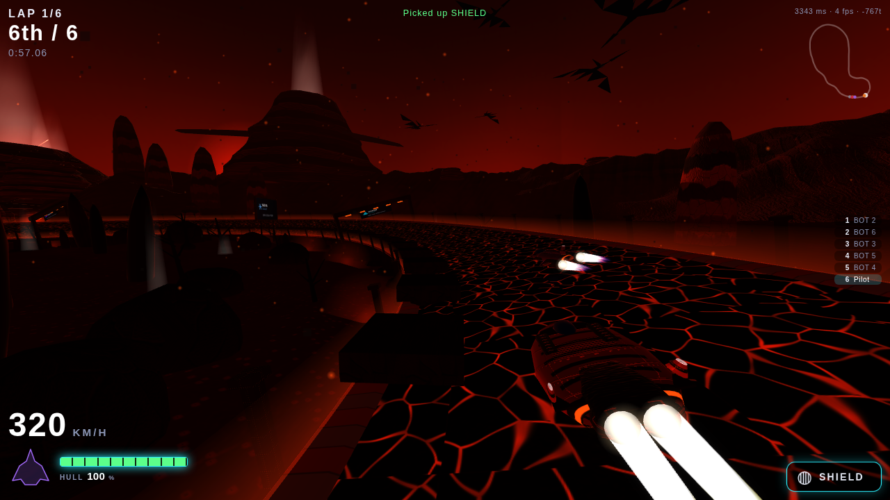 | 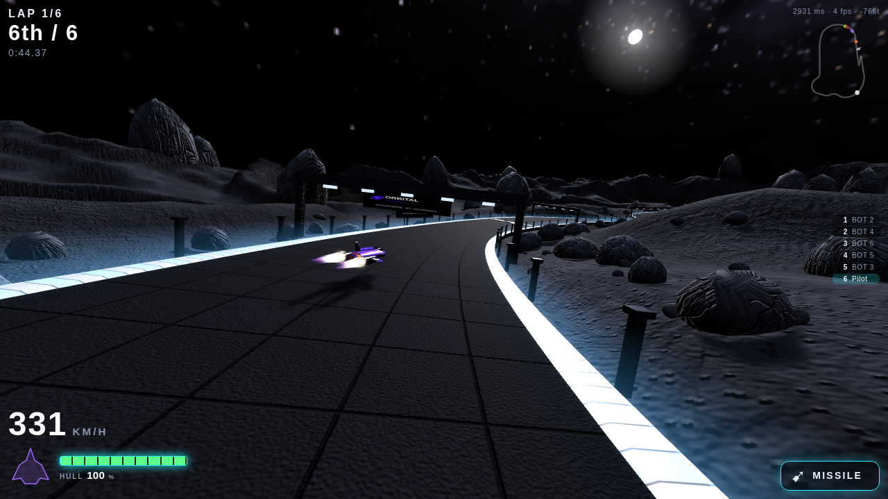 | 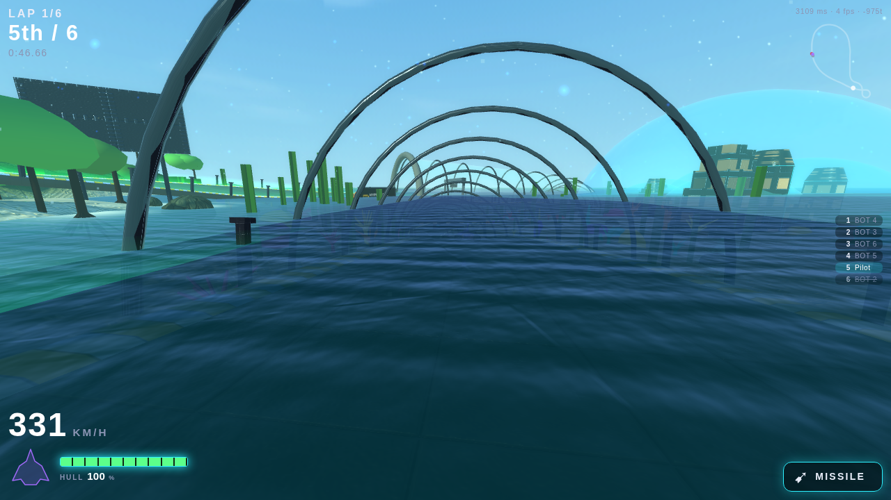 |
| 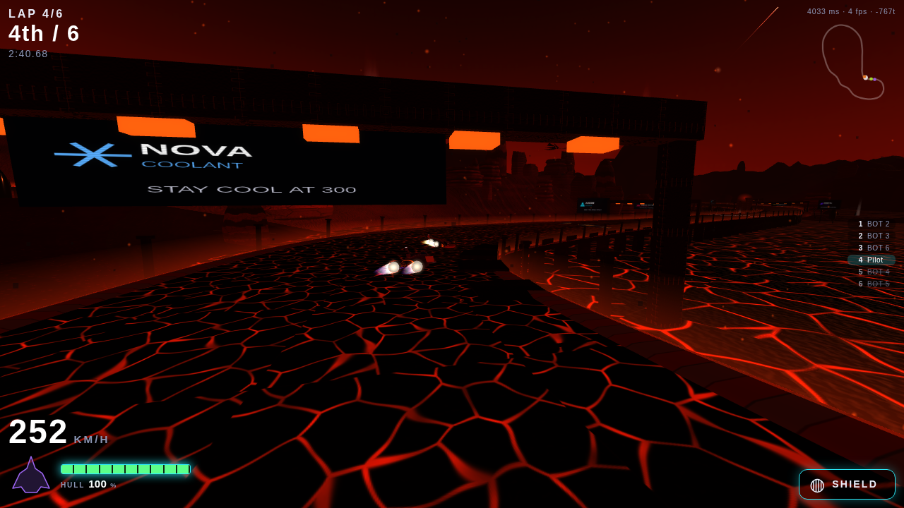 | 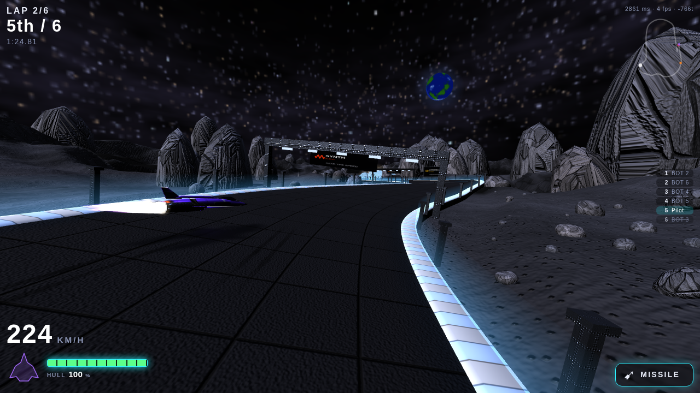 | 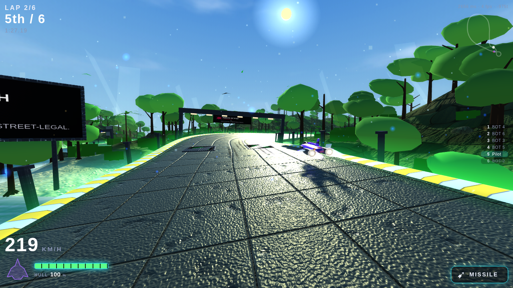 |
| 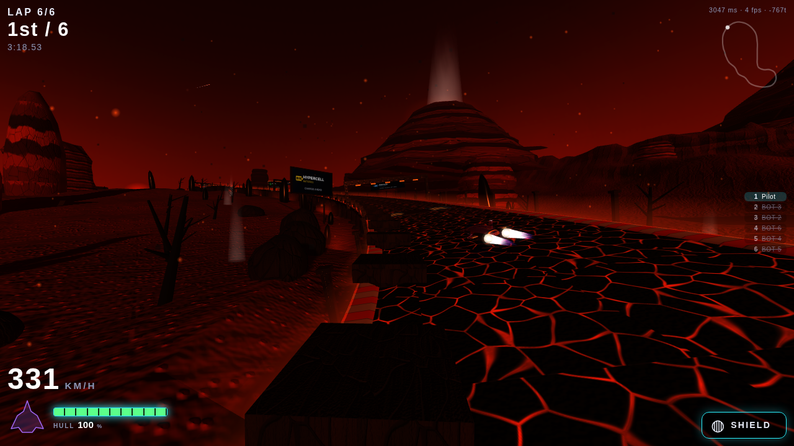 | 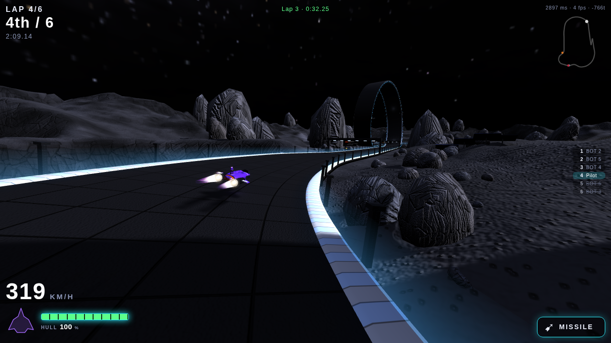 | 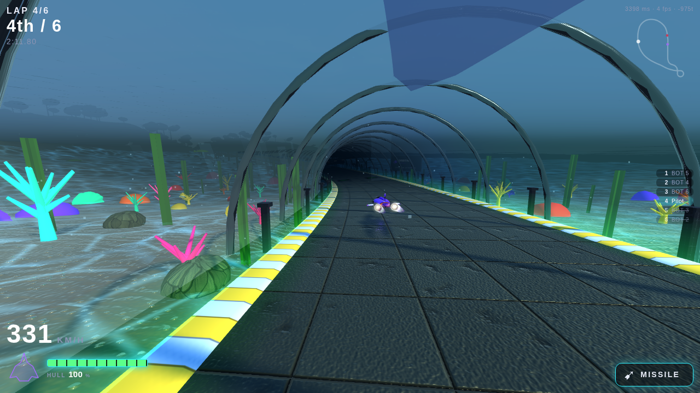 |

| Kestrel | Talon | Vantage |
|---|---|---|
|  |  |  |

| Bulwark | Reaper | Corsair |
|---|---|---|
|  |  |  |


The damage readout with the hull intact and with it nearly gone, and the trails leaving the
flame tips and tapering away behind a corsair:

| Hull intact | Hull critical |
|---|---|
| 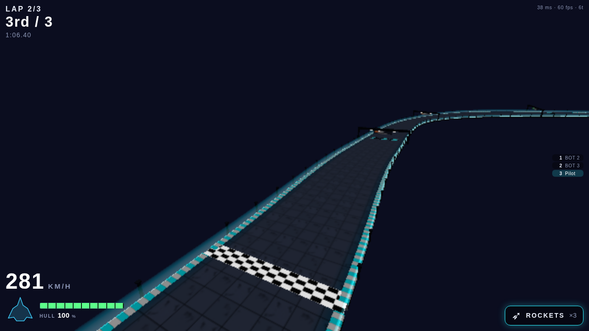 | 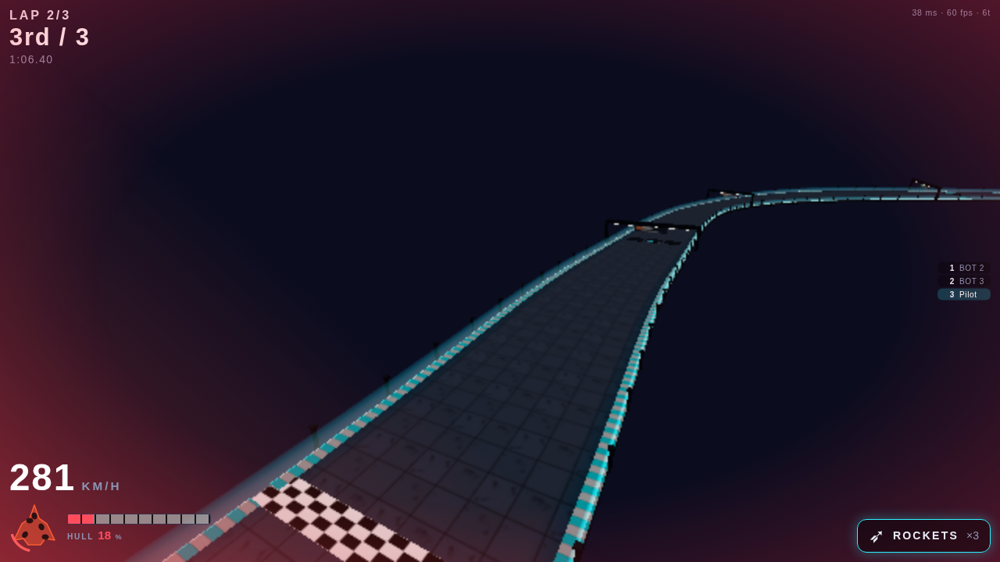 |

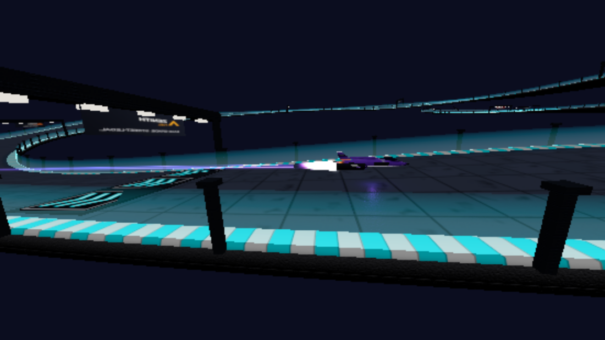

## Files

```
index.html          screens + CSS          src/net.js        prediction, reconciliation, interpolation
src/main.js         wiring, camera, loop   src/input.js      keyboard / gamepad / touch
src/hud.js          race HUD, minimap      src/audio.js      synthesized engines, weapons, music
src/render/         track ribbon, craft meshes, the lobby's craft preview, effects, procedural textures, six environments
../shared/agrav/    the simulation the server runs (module.js, sim/, tracks/, vehicles.js, bot.js)
```

Add `?lite=1` to the URL for a scenery-free, bloom-free client (weak devices, headless tests).
