# AGRAV

Anti-gravity combat racing for up to twelve players, in the browser.

## Race

Create a race (you become the host) or join one by code or from the public list. The host
picks the track and the lap count, can add bots and starts once everyone is ready. Three
laps by default. **Zero health eliminates you**: the craft explodes and you spectate
(tap or click to follow another racer) until the race ends. A race ends when every
surviving craft has finished, or 45 seconds after the first one did. Finished craft keep
driving a cool-down lap. Results rank finishers by time, then everyone else by distance.

| Keyboard | Gamepad | Touch |
|---|---|---|
| ← → or A D steer | left stick / d-pad | drag left/right in the steering zone (or tilt, in settings) |
| ↑ / W throttle · ↓ / S brake | A or RT throttle · LT brake | automatic throttle · BRK button |
| Q / E airbrakes | LB / RB | AIR L / AIR R |
| space fire | X or B | FIRE |

Airbrakes tighten a turn and bleed speed; you need them for the hairpins. Hands off the
stick and the craft settles back along the track, but it never steers a bend for you.
Walls scrape health away; hit one hard and you lose speed and armour. A crest that falls
away faster than gravity launches you.

## Craft

| | Speed | Accel | Turn | Damage | Armour |
|---|---|---|---|---|---|
| **Kestrel** | + | − | − | − | − |
| **Talon** | | ++ | | | − |
| **Vantage** | − | | ++ | | − |
| **Bulwark** | − | − | | | ++ |
| **Reaper** | | | − | ++ | |
| **Corsair** | the honest choice | | | | |

`tools/balance.js` keeps every craft's solo lap time within 3 % of the others on every track.

The hulls are lofted on the client (`src/render/vehicle.js`): superellipse sections swept along
each ship, wings and fins lofted the same way, panel seams pressed into the mesh along the lines
the livery paints. Each ship wears a painted 1024² atlas (`src/render/livery.js`) with albedo,
normal, bump, roughness and emissive maps: team paint and pattern, a race number, panel lines and
rivets, the team wordmark and four sponsor decals. Sponsors are invented: Umbrella Corporation,
Zenith Fuel, Neo-Kyo Dynamics, Axiom Avionics, Pulse, Vanta Optics, Orbital Logistics, Hypercell,
Synth Audio, Nova Coolant.

| Craft | Shape | Livery |
|---|---|---|
| **Kestrel** | slim centre body, forward-swept pontoons, joining wing, twin small nozzles | cyan, stripes, #7, Zenith title |
| **Talon** | blunt nose, wide delta deck, one broad engine, intakes beside the canopy | orange, chevrons, #21, Pulse title |
| **Vantage** | catamaran hulls, bridge deck, pylon nacelles, forward planes | lime, split colour, #3, Vanta Optics title |
| **Bulwark** | armoured slab, ram nose, four stubby nozzles, thick low fin | grey, checker band, #44, Umbrella Corporation title |
| **Reaper** | knife nose, forward-canted side fins, tall tail, nacelles under the wings | red, flames, #13, Umbrella Corporation title |
| **Corsair** | teardrop fuselage, swept wing, tall fin, root-mounted nacelles | violet, pinstripe, #1, Orbital title |

## Tracks

- **Neon Meridian** — night city: a canyon between towers, a climb onto an elevated ramp
  with a jump, a plunge into an underpass, a chicane under the ramp, a hairpin home.
- **Sunfall Canyon** — desert: a rim run, a drop off a shelf onto the river floor, a
  banked hairpin, a climb back through the strata.
- **Cape Vanta** — coastal cliffs: cliff-edge sweepers, a tunnel through the headland, a
  jump across the cove, a chicane on the beach, a long sweep round the south point.

## Items

Pads on the track hand out one item; drive over one while holding nothing. Trailing racers
get better odds of missiles and shields, leaders of mines and the minigun.

| Item | |
|---|---|
| Rockets ×3 | fast and straight; hold fire for the burst |
| Missile | locks the nearest craft ahead and homes; a shield absorbs it |
| Minigun | two seconds of hitscan, lag-compensated |
| Mines ×3 | dropped behind you; arm after half a second; live 30 s |
| Repair | +40 health |
| Shield | 5 s of invulnerability |
| Turbo | 3 s at +35 % top speed |

## Environments

Everything you see beside the road is generated on the client from a seed the moment the
track is chosen (the lobby prewarms it), so the server ships nothing but the ribbon:

- **Material sets** (`src/render/surfaces.js`): a height function per surface is evaluated
  once per texel and yields the albedo, a Sobel normal map, a bump map, a roughness map and,
  for the city facades, an emissive map with lit windows. Asphalt with recessed panel seams and
  puddles, canyon strata with cracks and ledges, striated coastal rock, rippled sand, riveted
  plating, formwork concrete, water normals.
- **Terrain** (`src/render/terrain.js`): one displaced grid per track. Each vertex knows its
  nearest ribbon frame, the theme shapes the landscape from that (ridged canyon walls and a
  river channel, cliffs falling through a beach into the sea), and a corridor rule caps the
  ground just under the road so it never pokes through while bridges stay bridges. The material
  blends two sets by slope and samples them triplanar so cliff faces do not smear.
- **Displaced geometry** (`src/render/props.js`): rocks, mesas, cliff slabs, sea stacks and
  arches are primitives pushed by 3D noise; towers come tiered, round or stepped with ledges and
  rooftop clutter; tunnels are cross-sections swept along the ribbon and roughened.
- **Neon Meridian's life** (`src/render/env/city.js`): wall screens run generated adverts of six
  kinds (wordmarks, product discs, glyph walls, the watching eye, tickers, racing promos) and swap
  and flicker; vertical kanji signs and small signage crowd the road-facing faces; a skytrain weaves
  on a lit guideway suspended above the expressway; ten stacked lanes of flying traffic (taxis
  first) climb the canyon between the towers; glass sky bridges cross high over the road;
  searchlights sweep from the tallest roofs. Everything moving stays above the road or beyond the
  barriers, so none of it touches the race.
- **Track furniture** (`src/render/track.js`): a concrete deck under the road, rumble-strip
  curbs, barrier posts carrying the energy wall, light gantries, pad housings, skid marks at the
  braking zones.
- **Light**: the sun casts soft shadows in a box that follows the camera, wet asphalt, water and
  hulls reflect a pre-filtered copy of the sky dome, and the quality governor drops shadows, then
  the fine-detail layer (grass, mist, birds, traffic, drones, cables) before it touches resolution.

## Screenshots

Rendered by `node tools/shots.js` (headless Chromium, software GL, so the frame counter
in the corner reads low; a real GPU runs the same scene at 60 fps). The first detail pass is
kept in `docs/screenshots/pass1/` for comparison.

| Neon Meridian | Sunfall Canyon | Cape Vanta |
|---|---|---|
| 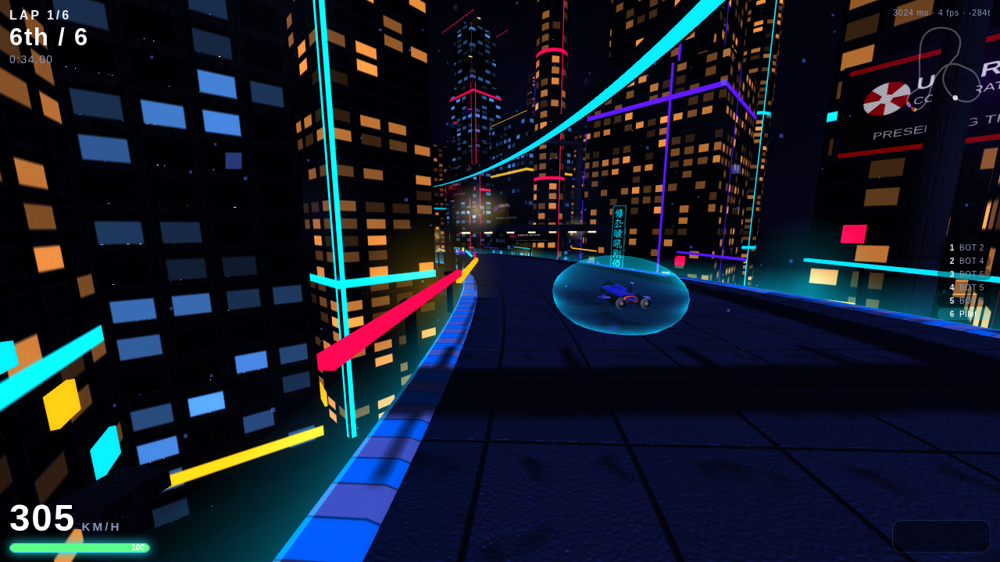 | 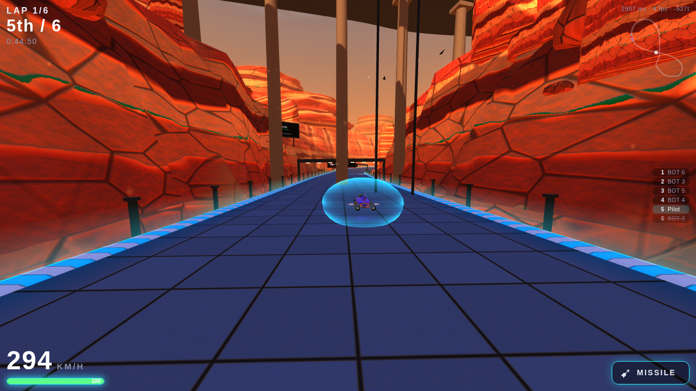 | 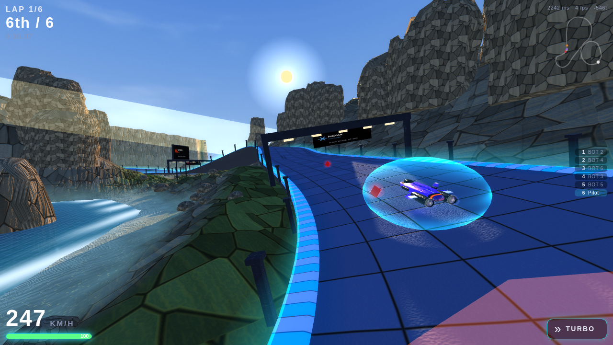 |
| 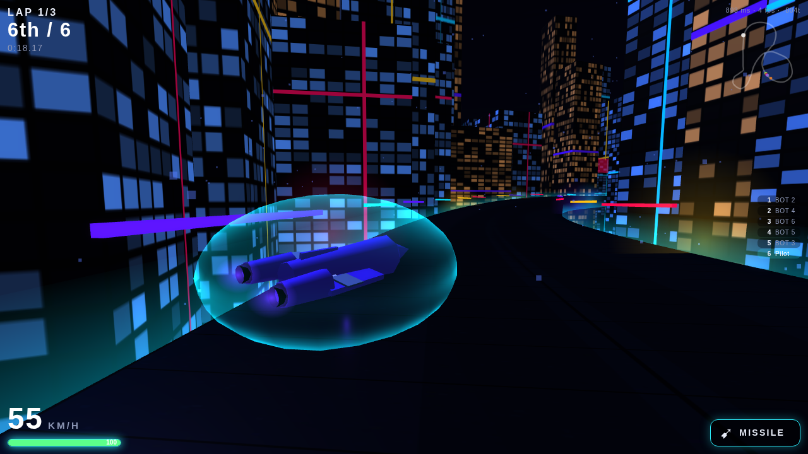 | 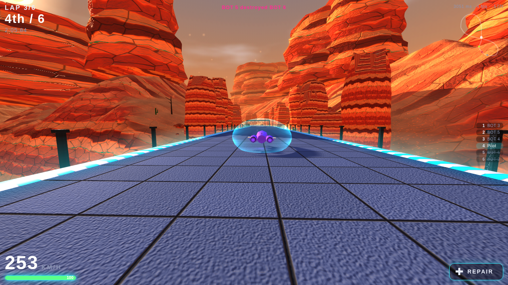 | 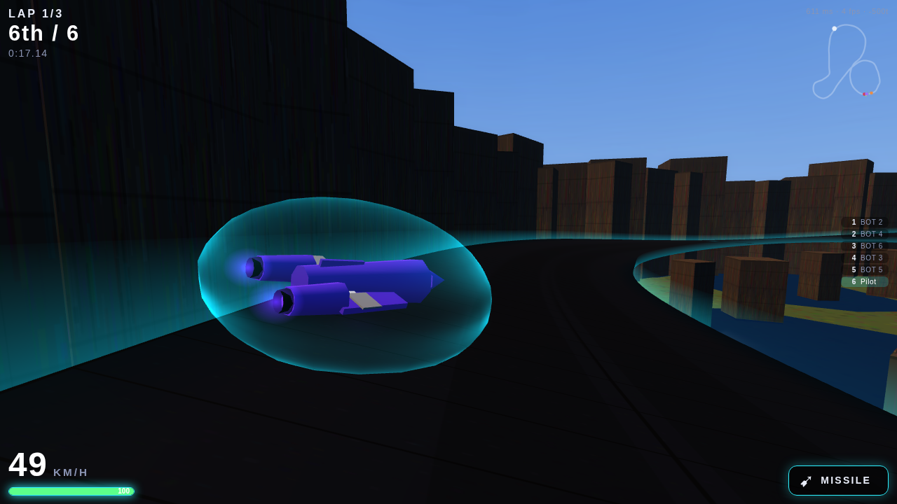 |
| 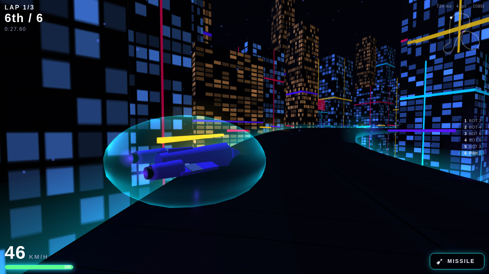 | 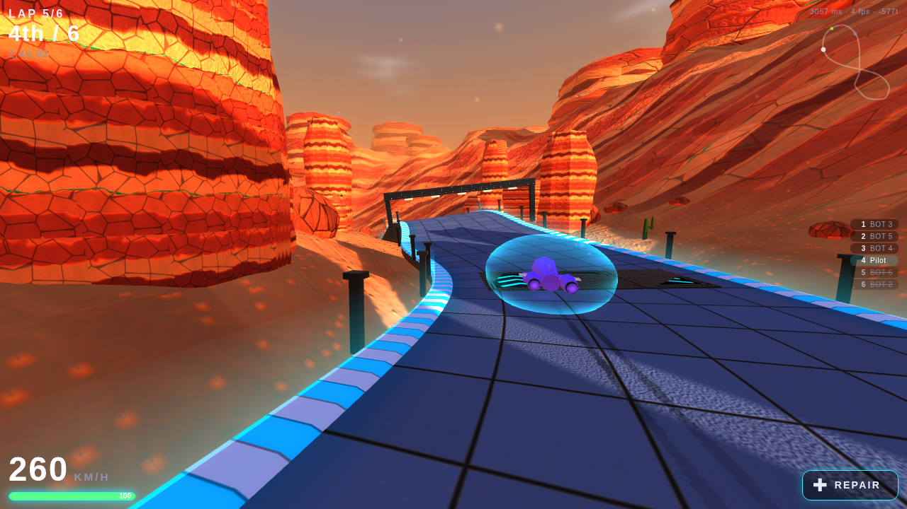 | 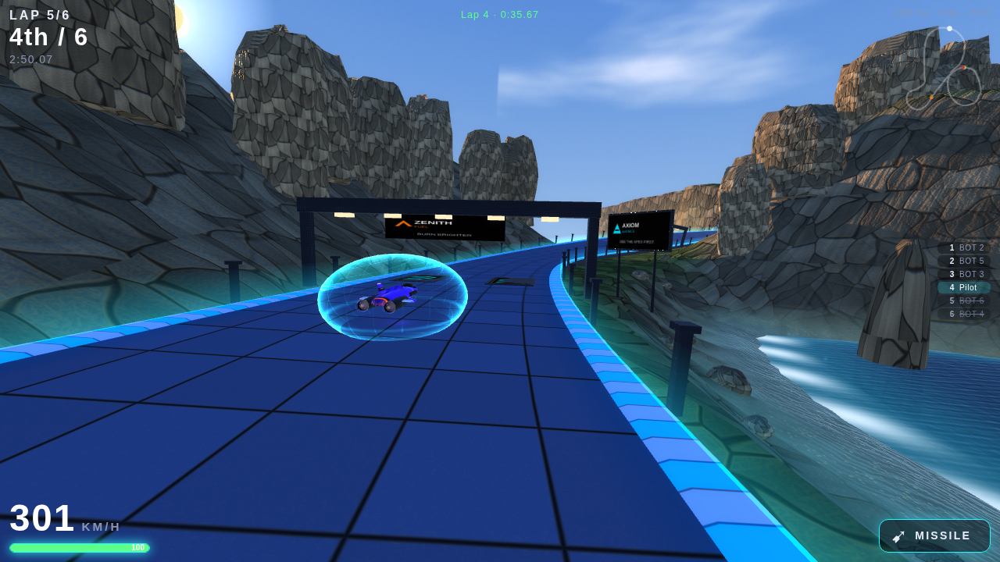 |

| Kestrel | Talon | Vantage |
|---|---|---|
| 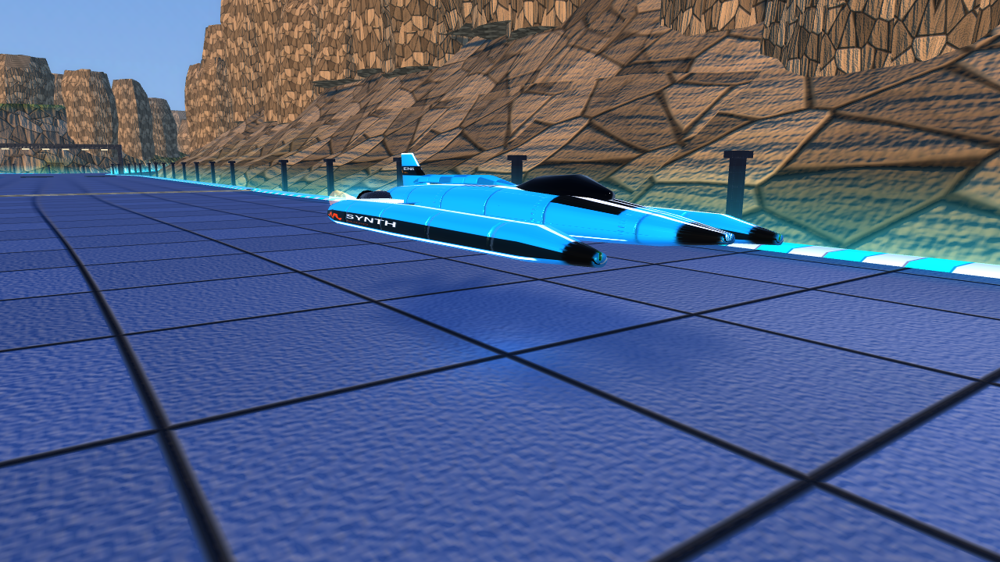 | 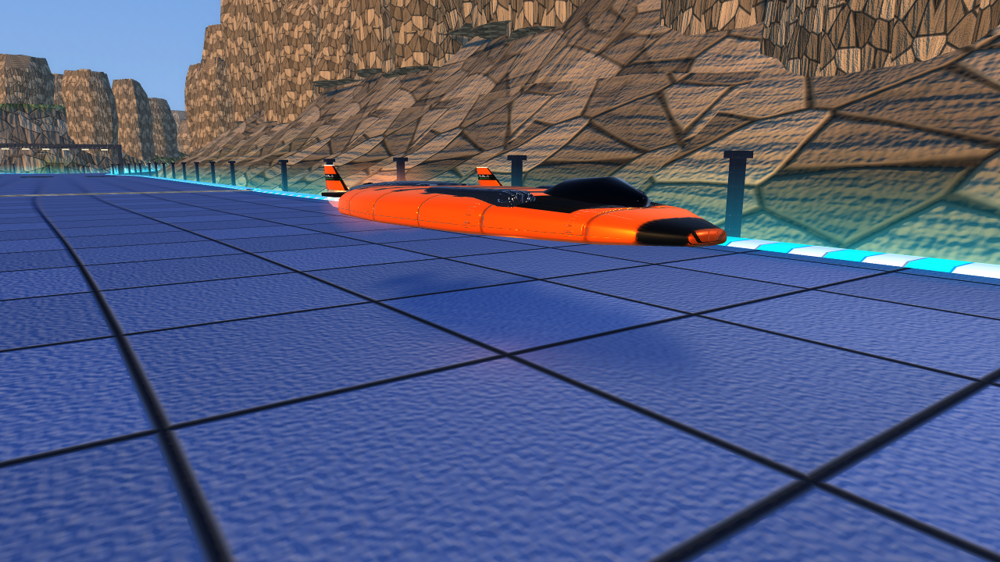 | 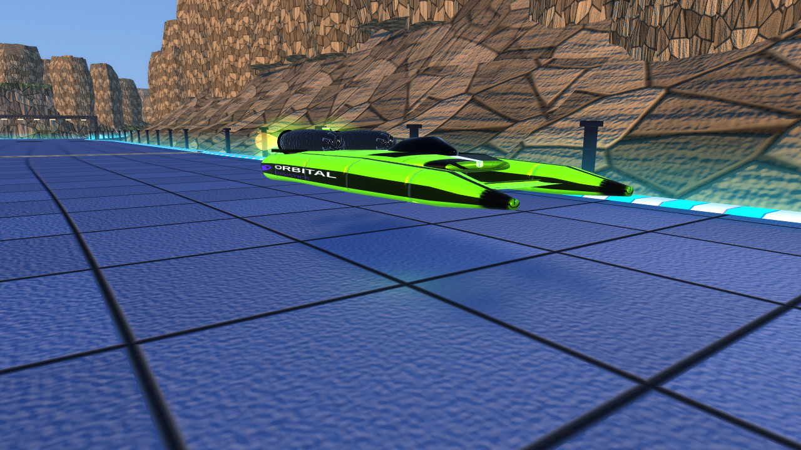 |

| Bulwark | Reaper | Corsair |
|---|---|---|
| 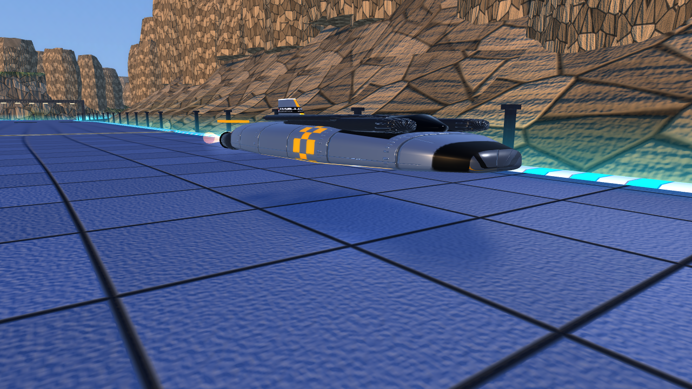 | 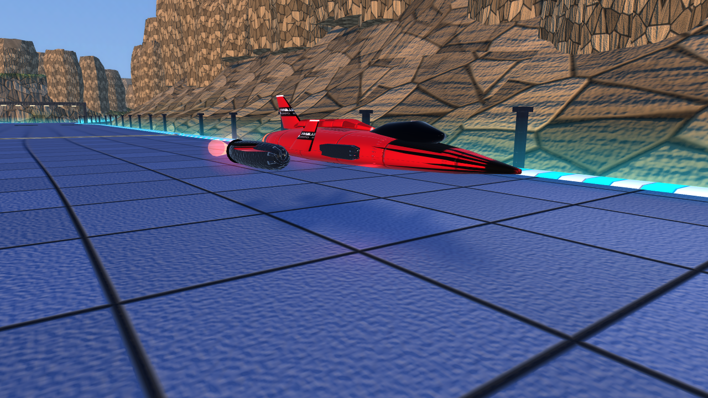 | 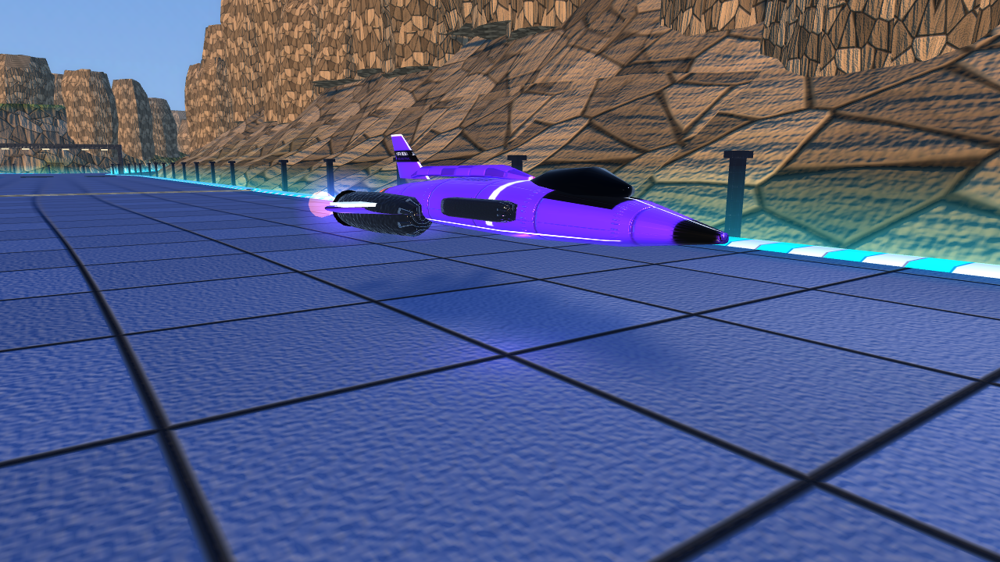 |

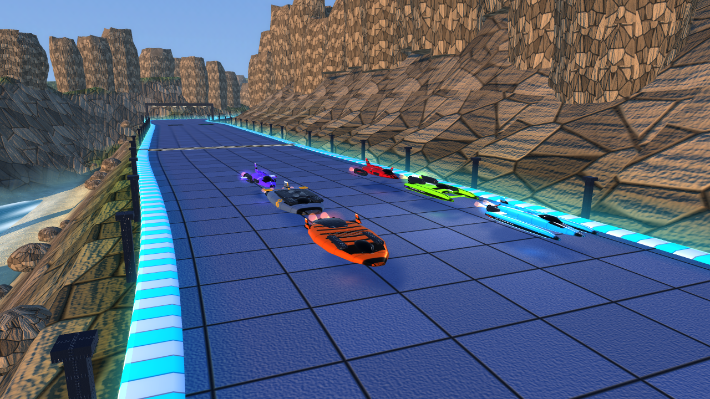

## Files

```
index.html          screens + CSS          src/net.js        prediction, reconciliation, interpolation
src/main.js         wiring, camera, loop   src/input.js      keyboard / gamepad / touch
src/hud.js          race HUD, minimap      src/audio.js      synthesized engines, weapons, music
src/render/         track ribbon, craft meshes, effects, procedural textures, three environments
../shared/agrav/    the simulation the server runs (module.js, sim/, tracks/, vehicles.js, bot.js)
```

Add `?lite=1` to the URL for a scenery-free, bloom-free client (weak devices, headless tests).
