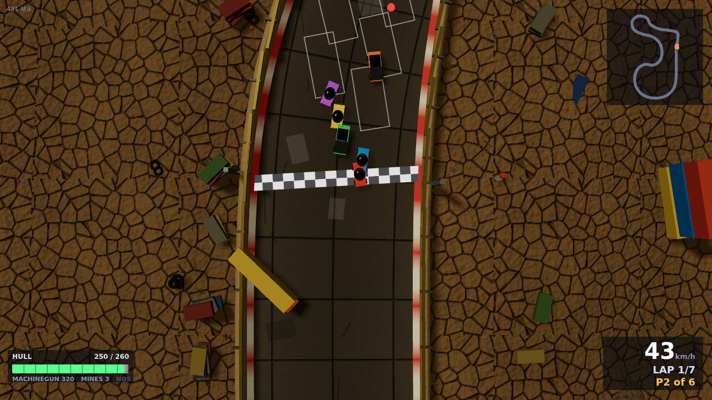
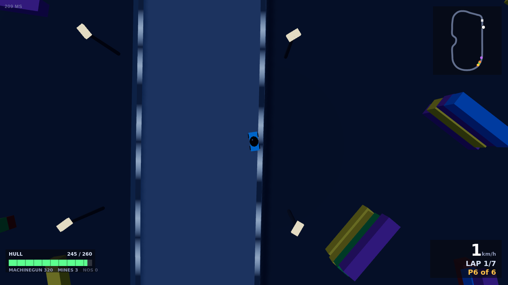
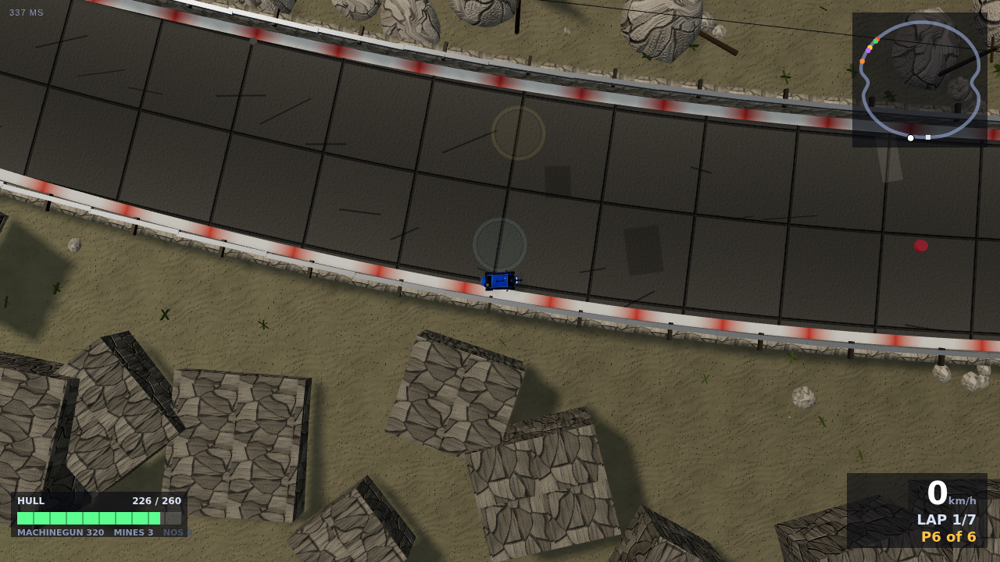
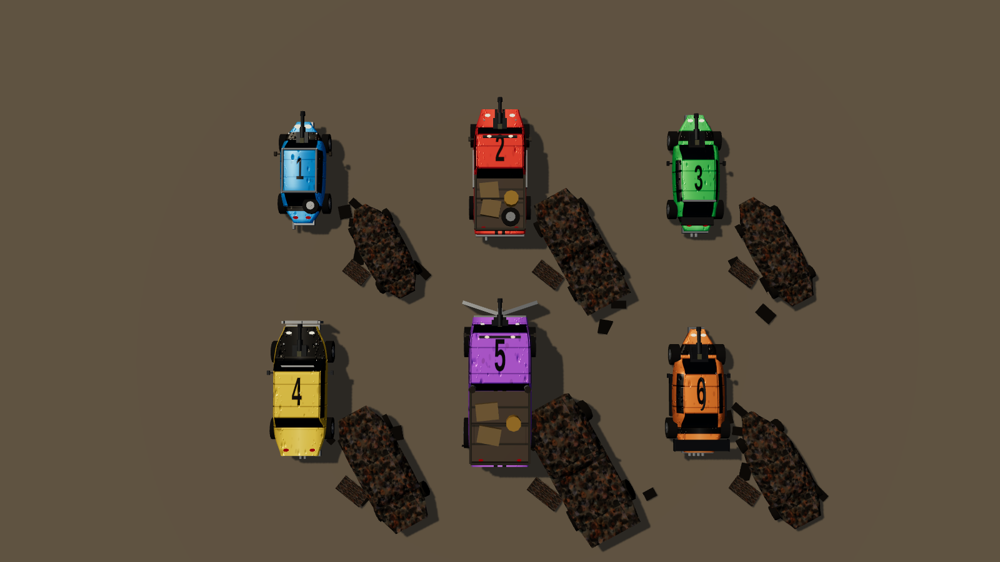

# Scrap Rally

Top-down car combat for up to six drivers, in the browser. The third game on the
AGRAV games platform, sharing its server, lobby, netcode and reconnect for free.

## Race

**Race solo vs bots** needs no server: the lobby and room engine runs inside the page, so the
game works from a static deploy (GitHub Pages) or offline once installed, career and all —
the garage is kept in `localStorage` there instead of on the server.

Create a race (you become the host) or join one by four-letter code or from the
public list. The host picks the circuit, the lap count and how hard the bots
drive. **Every seat nobody takes becomes a bot when the host starts**, so one
player can race a full grid, and the host can switch that off to race only the
seats that are filled.

**Two ways to win.** Cross the line first after the laps are done, or be the last
car still running: the moment the field is down to one, that car has won and the
race is over, whatever lap it is on. After the first car is home the rest have
twenty seconds to finish for placing, and during that grace a car that is
already home can neither be hurt nor hurt anyone, so a winner cannot sit on the
line and shoot second place out of its prize money.

**Zero hull explodes the car.** The burnt shell stays in the road for the rest of
the race at about two-thirds the size of a car, so a kill leaves a chokepoint
you made. A driver who disconnects and runs out of reconnect time simply
vanishes, leaving nothing behind for the others to hit.

| Keyboard | Gamepad | Touch |
|---|---|---|
| ← → or A D steer | left stick / d-pad | drag left or right in the steering zone |
| ↑ / W throttle | A / RT | automatic throttle |
| ↓ / S brake, and again at rest to reverse | B / LT | BRK |
| space fire | X / RB | FIRE |
| M drop a mine | B | MINE |
| N or shift nitro | LB | NOS |

Steering is car-relative: left is always the car's left, whichever way it is
pointing. A key is a switch and a wheel is not, so keyboard steering winds on
over about a tenth of a second rather than snapping to full lock.

## The cars

A car is a free body on the ground plane. The engine and brakes act on the
forward part of its velocity and the tyres scrub the sideways part; how fast
they scrub it is the Handling stat. Let go of enough of it and the car is
sliding, with less grip and less steering, and the barrier is right there.

Anything you are pressed against — a barrier, a container, a burnt-out shell —
takes speed off along it in proportion to how hard you are leaning on it, and
pushes you out of it in proportion to how far in you are. Leaning on a wall is
expensive and getting shunted into one is worse, but neither of them parks you.

| | Speed | Handling | Armour | |
|---|---|---|---|---|
| **Vagabond** | − | − | − | a rounded little beetle with a roll cage bolted through the roof |
| **Mongrel** | | − | | a flatbed pickup with plate over the doors |
| **Stiletto** | + | | − | a stripped coupe: quick and sharp, and made of paper |
| **Warden** | | | + | an armoured saloon that does nothing badly |
| **Behemoth** | | − | ++ | a truck cab with a blade on the front |
| **Valkyrie** | ++ | + | + | the prototype nobody admits to building |

Three stats, five levels each, **bought per car**: a new car starts stock, because
the upgrades and the spikes stayed with the one you traded in. Armour buys hull
and the weight to shrug off a shunt; Handling buys the grip and the steering rate
that keep you off the walls; Speed buys the top end and how fast you reach it.

## Weapons

The primary is fixed forward, so a car aims by pointing, and is chosen in the
lobby from among the ones your record owns. Every shot is scored against where
the cars were about a hundred milliseconds ago, so it hits what the shooter could
see. Wrecks and the scenery stop bullets, which is what turns the crusher and a
burnt-out shell into cover.

| | |
|---|---|
| **Machine gun** | accurate, endless and unexciting; it will do the job from anywhere |
| **Shotgun** | six pellets and a very short conversation, useless past a few car lengths |
| **Minigun** | takes a moment to wind up, then removes a whole car if you can hold it on one |
| **Mines ×3** | free, every race, and no respecter of whose they are; they arm after half a second |
| **Spiked bumper** | triple damage when you ram, half when you are rammed; bought per car |

The **laser sight** draws a line to whatever is inside the gun's cone. It is
cosmetic: the ray goes where the car points, and the sight only tells you what
the cone covers.

## Pickups

Pads hold what they always hold and come back twenty seconds after being taken,
so a lap is learnable and you fight for the repair kit every time round. Cash is
the exception: every so often a free pad is dressed as a cash drop for a few
seconds, so money is a bonus you notice rather than a corner you farm.

| Ammo | Nitro | Repair | Cash |
|---|---|---|---|
| a quarter of a magazine | a charge, worth two and a half seconds of forty percent more | eighty hull | eighty to two hundred and twenty |

## The garage

Money comes from where you finish, from kills, and from what you pick up off the
road. A car that exploded earns the last two and nothing for its place, which is
what makes racing a wreck a gamble rather than a free entry fee.

**Damage is persistent.** The hull you finish on is the hull you start the next
race on, and an exploded car comes home at nothing. **Repairs come first**: while
the hull is short, the only thing the shop will sell you is the repair, so the
prize money cannot go on a bigger engine while a wreck goes to the next grid. A
driver with almost nothing is never stranded — what they can pay for, they get.

Cars are bought and nothing else gates them. Buying the next one trades the old
one in for half its price and a quarter of what went into it. The ladder is
tuned so that about five wins, ten second places or fifteen starts each pay for
the climb to the Valkyrie; `node tools/rallysim.js --career` races all three
paths and reports where they land.

Your record lives in this browser behind a random key, which the garage shows as
a **transfer code** so you can pick the career up on another machine. There are no
accounts. A browser that will not let the game store anything still plays: a
stock Vagabond, a machine gun, and nothing saved.

## Circuits

| | | |
|---|---|---|
| **Scrapyard** | 1579 m | rust, oil and two long straights, one hairpin and a chicane past the crusher. The one where nobody has an excuse. |
| **Harbour** | 1603 m | the container docks after dark: a long quay straight, a fast open sweep round the basin, a chicane between the stacks, and a hairpin round the end of the wharf. |
| **Ridge** | 1995 m | a narrow pass with a long way down on one side, two chicanes through the rockfalls and a blind crest on the descent. Bring the handling. |

Prizes scale with the circuit (1.0, 1.3, 1.6) and with how hard the bots drive
(0.6, 1.0, 1.3), so the harder race is worth more.





## Files

```
index.html          screens + CSS         src/net.js      prediction, reconciliation, interpolation
src/main.js         wiring, camera, loop  src/input.js    keyboard / gamepad / touch -> {bits, steer}
src/garage.js       the shop              src/hud.js      hull, speed, lap, minimap, kill feed
src/audio.js        synthesized engines, guns, explosions
src/render/         camera, road and barriers, cars, effects, three circuit themes
../shared/gfx/      procedural materials, noise, geometry helpers, the mesh merger
../shared/rally/    the simulation the server runs (module.js, sim/, tracks/, cars.js, career.js, weapons.js, bot.js)
```

The client imports the same `shared/rally/` modules the server runs, so its
prediction of your own car is bit for bit the server's simulation. See
[`../shared/net/module-contract.md`](../shared/net/module-contract.md) for how a
game plugs into the platform.

Every car is a body lofted from its own plan outline — a beetle's wings, a
coupe's waist, a truck's slab sides — wearing a livery painted in plan on a
canvas and projected straight down, so the windscreen, the roof, the number and
the rust all land where they belong. Headlamps and tail lamps are real unlit
meshes, since at racing zoom they are the first thing you can see of a car.
What the driver bought shows: the weapon on the bonnet, the spiked bumper, a
plate of armour for each upgrade.



Every material on a circuit is computed on the client from a height function —
albedo, normal, bump and roughness — so nothing is downloaded and the server
knows about none of it. The ground mixes two of them by a vertex attribute, the
road is shaded across its width for the racing line and the grit at its edges,
and the verges are merged down to one mesh per material before they go in.
Anything that passes over the road fades out as you drive under it.

Add `?lite=1` to the URL for a scenery-free client (weak devices, headless tests).

## Tools

```sh
node tools/rallylint.js                  # every circuit: closure, width, obstacles, pads, grid
node tools/rallysim.js                   # headless bots: lap times, time against barriers, hull
node tools/rallysim.js --sweep           # how races end at each difficulty
node tools/rallysim.js --career          # the three paths up the ladder
node tools/rallysim.js --ladder          # every car, alone, on every circuit
node tools/rallynet.js --players 6       # synthetic clients over a lossy socket
node tools/rallytest.js                  # two headless browsers, a whole race, then the garage
node tools/rallyshots.js                 # screenshots of every circuit
node tools/rallycars.js                  # a contact sheet of the showroom
node tools/rallycars.js --angle 0.42     # the same, from low enough to see the shapes
```
